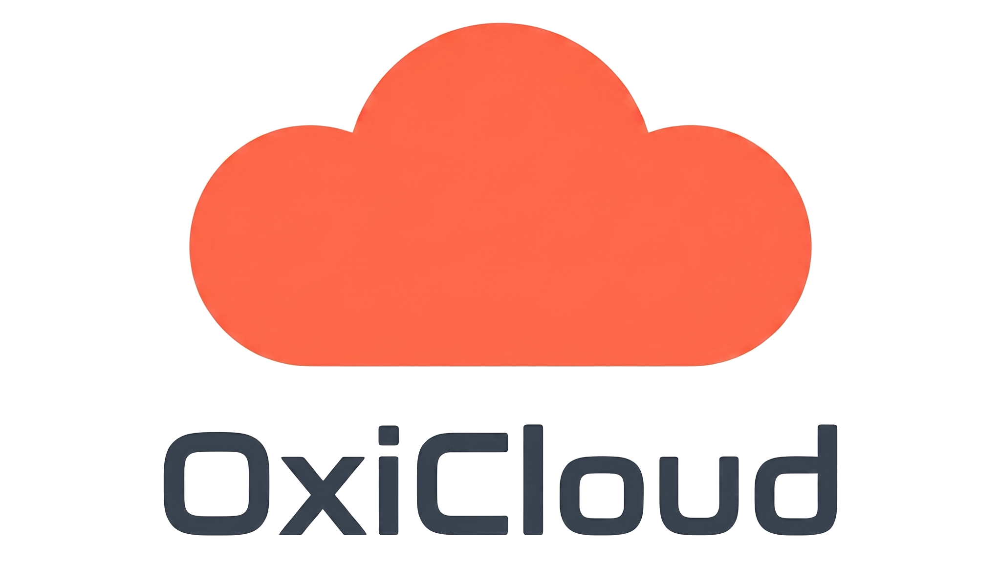

<p align="center">
  
</p>

<h1 align="center">oxicloud-public-proxy</h1>

<p align="center">
  Public reverse proxy for <a href="https://github.com/AtalayaLabs/OxiCloud">OxiCloud</a> share links.
</p>

---

## Upstream compatibility status

This proxy depends on two patches to OxiCloud. Both have been submitted to the official repository:

| PR | Status | What it enables |
|---|---|---|
| [AtalayaLabs/OxiCloud#346](https://github.com/AtalayaLabs/OxiCloud/pull/346) | **Merged** | Share-password unlock-cookie - fixes the 401 returned by the Download button on password-protected file shares. |
| [AtalayaLabs/OxiCloud#347](https://github.com/AtalayaLabs/OxiCloud/pull/347) | **Open** | Public folder-browsing endpoints (`/api/s/{token}/contents`, `/api/s/{token}/file/{id}`, `/api/s/{token}/zip`) - required for folder shares, in-folder streams, and ZIP downloads. |

Plain file shares without a password work on any OxiCloud build. Until PR #347 lands in a release, folder-related features fall back to an error page.

> *Temporary section - kept here while the patches are being upstreamed. It will be removed once both PRs are merged and released.*

---

## Overview

A small Node.js service that sits between the public internet and a private
OxiCloud instance. The only thing it exposes is the share-link URLs
(`/share/<token>`); your file browser, admin panel, and authentication stay
unreachable from outside.

When someone opens a share link on your public hostname, the proxy:

1. Calls OxiCloud's public share API on the private network.
2. Renders the result with a templated HTML view (file metadata, password
   prompt, folder gallery, expired notice).
3. Streams file downloads through, forwarding `Range`, `ETag` and
   `Set-Cookie` headers so video seek, resumable downloads, and password
   sessions work the same as on the upstream.

The proxy holds no OxiCloud credentials. Authorization is the share token
only, the same as opening a share directly on an exposed OxiCloud.

## Demo

A live instance is running at [oxi-demo.evtlab.pl](https://oxi-demo.evtlab.pl).

- Example share: <https://oxi-demo.evtlab.pl/share/dcdb1d4f-074d-48a2-953f-04cc8d9b6f18>
- Password: `demo123`

## Features

- File shares, with or without a password
- Folder shares with full in-browser browsing
  - Grid or list view, persisted per-browser
  - Image thumbnails, lazy-loaded video posters
  - Click-to-open lightbox with keyboard navigation
  - File-type icons (PDF, archive, code, fonts, ...)
  - Subfolder navigation with browser back support
- ZIP download for any folder in the share, root or subfolder
- `Range` / `ETag` passed through, so video seek and resumable downloads work
- English and Polish UI, picked from `Accept-Language`, override with `?lang=`
- A small landing page at `/` if someone hits the root

## Requirements

- Docker (for the recommended deployment)
- A reverse proxy in front for TLS (nginx, Traefik, Nginx Proxy Manager,
  Caddy, ...)
- An OxiCloud instance reachable from the proxy. A Docker service name, a
  LAN address, or a VPN address all work, as long as the proxy can call it

For local development without Docker: Node 22+ and `npm`.

## Quick start

```bash
git clone https://github.com/abnvle/oxicloud-public-proxy.git
cd oxicloud-public-proxy
cp .env.example .env
# edit .env, set OXICLOUD_INTERNAL_URL and PUBLIC_BASE_URL
docker compose up -d --build
```

Point your reverse proxy at `localhost:3000` and route your public hostname
there. The proxy itself does not terminate TLS.

## Configuration

| Variable | Default | Required | Notes |
|---|---|---|---|
| `OXICLOUD_INTERNAL_URL` | | yes | URL of OxiCloud reachable from the proxy. A Docker service name like `http://oxicloud:8086` or a LAN address like `http://192.168.0.205:8086`. |
| `PUBLIC_BASE_URL` | | yes | The public URL the proxy is served from, e.g. `https://files.example.com`. |
| `PORT` | `3000` | no | TCP port. Used for both the host port mapping in `docker-compose.yml` and the in-container listener, so they stay in sync. |
| `HOST` | `0.0.0.0` | no | Bind address. Default is right for containers. |
| `LOG_LEVEL` | `info` | no | One of `fatal`, `error`, `warn`, `info`, `debug`, `trace`. |

See `.env.example` for a copy-and-edit starting point.

### OxiCloud side

Set `OXICLOUD_BASE_URL` on your OxiCloud instance to the proxy's public URL,
so share links generated in the OxiCloud UI point at the proxy:

```
OXICLOUD_BASE_URL=https://files.example.com
```

OxiCloud generates `/s/<token>` URLs; the proxy serves the canonical
`/share/<token>` path and redirects `/s/<token>` to it, so links copied
from OxiCloud work as-is.

## Routes

```
GET  /                              landing page
GET  /healthcheck                   liveness probe (200 / "ok")
GET  /s/:token                      301 → /share/:token (OxiCloud-native URL format)
GET  /share/:token                  share page (file / folder / password / expired)
POST /share/:token/auth             submit password
GET  /share/:token/download         file share download
GET  /share/:token/folder/:id       subfolder gallery
GET  /share/:token/file/:id         file inside folder share
GET  /share/:token/zip              folder share as ZIP
GET  /share/:token/zip/:id          subfolder as ZIP
GET  /public/*                      static assets (logo, file-type icons)
```

## Reverse proxy

Any TLS-terminating reverse proxy works. The proxy is a single HTTP
listener on the configured port, so the upstream config is trivial.

nginx:

```nginx
location / {
    proxy_pass http://localhost:3000;
    proxy_set_header Host $host;
    proxy_set_header X-Forwarded-For $proxy_add_x_forwarded_for;
    proxy_set_header X-Forwarded-Proto $scheme;
}
```

For Traefik or Nginx Proxy Manager, point the host to the proxy container's
port and let the manager handle the rest. No special config is needed for
streaming or large files; downloads and ZIPs use HTTP/1.1 chunked transfer.

## Development

```bash
npm install
cp .env.example .env
# edit .env
npm run dev
```

`npm run dev` uses `tsx watch` with Node's native `--env-file`, so saving a
file in `src/` reloads the server.

## Security notes

- The proxy holds no OxiCloud admin credentials. Share tokens are the only
  authorization, same as on an exposed OxiCloud.
- Tokens are validated with a strict regex before any upstream call.
- POST body size is capped at 64 KiB (the only POST is the password form).
- The unlock cookie issued by OxiCloud after a successful password verify
  is `HttpOnly` and scoped per-share-token; the proxy passes it through
  unmodified.
- TLS is the responsibility of the reverse proxy in front. The proxy itself
  speaks plain HTTP on a private port.

## License

[MIT](LICENSE).
